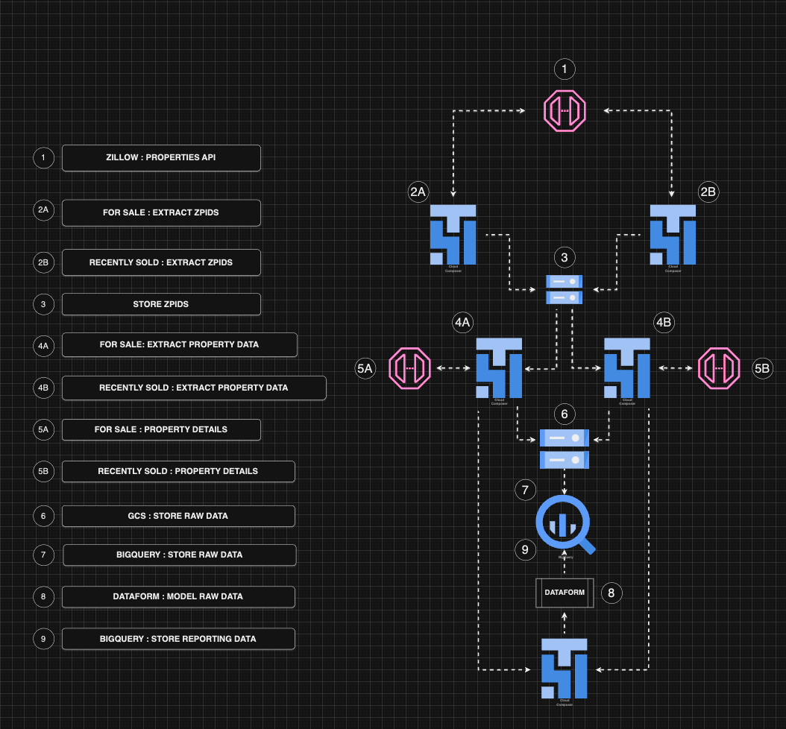

# Zillow Data Pipeline

I've been running this pipeline and you can find the results of the processing in this dataset I posted on [Kaggle](https://www.kaggle.com/datasets/tonygordonjr/zillow-real-estate-data?select=property_listings.csv).  This Zillow data is being extracted from this [RapidAPI service](https://rapidapi.com/apimaker/api/Zillow.com)

# System Design
This README provides a detailed overview of the system design for pulling and processing data from Zillow's API. The system facilitates efficient extraction, storage, transformation, and reporting of property data.

## Overview
The pipeline automates the ingestion of Zillow property data for listings that are either **for sale** or **recently sold**. The system processes data through several key stages, from extraction to reporting, using cloud-based storage and processing tools.

### Components

#### 1. **Zillow Properties API**
   - The primary data source for property listings.
   - Supports endpoints for fetching data related to properties **for sale** and **recently sold**.

#### 2. **Extract ZPIDs**
   - **2A**: Extract ZPIDs for properties that are currently **for sale**.
   - **2B**: Extract ZPIDs for properties that are **recently sold**.
   - ZPIDs (Zillow Property IDs) act as unique identifiers for each property.

#### 3. **Store ZPIDs**
   - Collected ZPIDs are stored in a centralized database for further processing.

#### 4. **Extract Property Data**
   - **4A**: Fetch detailed property data for ZPIDs from **for sale** listings.
   - **4B**: Fetch detailed property data for ZPIDs from **recently sold** listings.

#### 5. **Property Details**
   - **5A**: Detailed property data for **for sale** listings.
   - **5B**: Detailed property data for **recently sold** listings.
   - Data includes property specifications, pricing, and transaction history.

#### 6. **GCS: Store Raw Data**
   - Raw data from Zillow API is stored in **Google Cloud Storage (GCS)** for backup and archival purposes.

#### 7. **BigQuery: Store Raw Data**
   - Raw data is loaded into **BigQuery** for preprocessing and querying.

#### 8. **Dataform: Model Raw Data**
   - **Dataform** is used to clean, transform, and model the raw data into a structured format suitable for analytics.

#### 9. **BigQuery: Store Reporting Data**
   - Processed and transformed data is stored in a **reporting dataset** in BigQuery.
   - This dataset is optimized for generating insights and analytics.

## Workflow

1. **Data Ingestion**:
   - Fetch ZPIDs from Zillow Properties API for both **for sale** and **recently sold** properties.
   - Store ZPIDs in a centralized database for downstream processing.

2. **Data Processing**:
   - Extract detailed property data using ZPIDs.
   - Separate processes handle data for **for sale** and **recently sold** listings.

3. **Data Storage**:
   - Store raw data in **Google Cloud Storage** for backups.
   - Load raw data into **BigQuery** for querying and preprocessing.

4. **Data Transformation**:
   - Use **Dataform** to transform raw data into a structured format.
   - Create models for reporting and analytics.

5. **Data Reporting**:
   - Store the final, transformed data in a **reporting dataset** in BigQuery.
   - Data is ready for dashboards, analytics, or external reporting tools.

---

### Technical Details

#### Tools & Services
- **Zillow Properties API**: Data source for property listings.
- **Google Cloud Storage (GCS)**: Storage for raw data.
- **BigQuery**: Database for processing and querying raw and transformed data.
- **Dataform**: Tool for modeling and transforming raw data.

#### Data Flow
1. Extract ZPIDs.
2. Store ZPIDs in a database.
3. Fetch detailed property data using ZPIDs.
4. Store raw data in GCS and BigQuery.
5. Transform raw data using Dataform.
6. Store reporting data in BigQuery for analytics.

## Future Enhancements

1. **Error Handling**: Improve robustness for API rate limits and failures.
2. **Data Quality Checks**: Add validation steps to ensure data accuracy.
3. **Scalability**: Optimize the pipeline for handling larger datasets.
4. **Visualization**: Integrate with BI tools for real-time dashboards.

